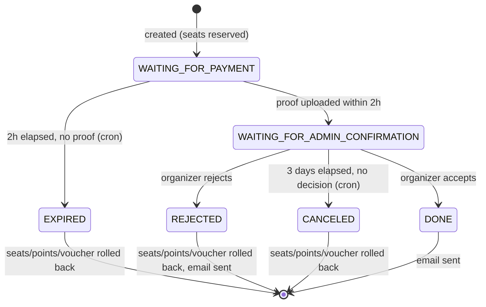
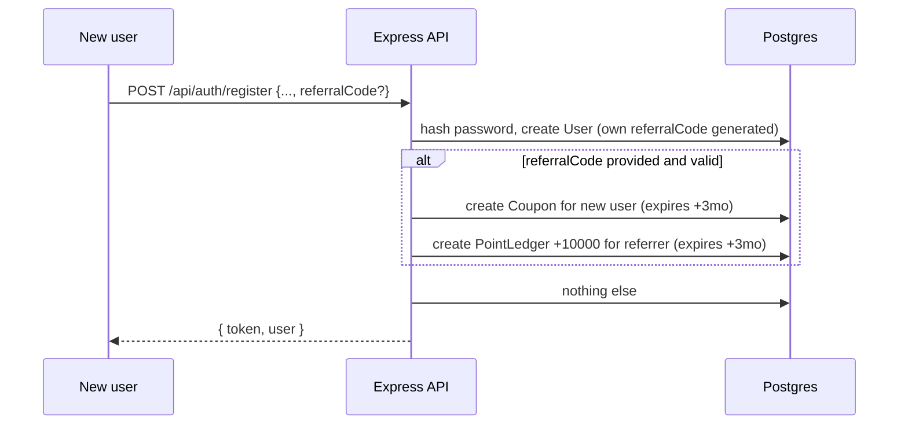

# Entity Relationship Diagram — Event Management Platform

Source of truth for the schema is [`server/prisma/schema.prisma`](../server/prisma/schema.prisma). This covers the full data model for both features:

| Tables | Feature |
|---|---|
| `User`, `PointLedger`, `Coupon` | Feature 2 — auth, referral, points, coupons, profile |
| `Category`, `Event`, `TicketType`, `Voucher`, `Transaction`, `TransactionItem`, `Review` | Feature 1 — event discovery/creation, transactions, reviews |

Feature 1's code only *reads* `User` (to attach an organizer/customer to an event or transaction) and *creates* `PointLedger`/`Coupon` rows when a transaction spends or refunds them — it never touches `passwordHash`, `resetTokenHash`, or any other auth-only column.

```mermaid
erDiagram
    USER ||--o{ EVENT : organizes
    USER ||--o{ TRANSACTION : makes
    USER ||--o{ REVIEW : writes
    USER ||--o{ POINT_LEDGER : has
    USER ||--o{ COUPON : owns
    USER ||--o{ USER : refers

    CATEGORY ||--o{ EVENT : classifies

    EVENT ||--o{ TICKET_TYPE : offers
    EVENT ||--o{ VOUCHER : issues
    EVENT ||--o{ TRANSACTION : sold_via
    EVENT ||--o{ REVIEW : receives

    TICKET_TYPE ||--o{ TRANSACTION_ITEM : purchased_as

    VOUCHER ||--o{ TRANSACTION : applied_to
    COUPON ||--o{ TRANSACTION : applied_to

    TRANSACTION ||--|{ TRANSACTION_ITEM : contains
    TRANSACTION ||--o| REVIEW : reviewed_by

    USER {
        string id PK
        string email UK
        string passwordHash
        string name
        enum role "CUSTOMER | ORGANIZER"
        string profilePicture
        string referralCode UK
        string referredById FK
        string resetTokenHash "forgot-password flow, hashed + expiring"
        datetime resetTokenExpiresAt
    }

    POINT_LEDGER {
        string id PK
        string userId FK
        int amount "+earned / -spent"
        string reason
        datetime expiresAt "earned rows only, +3 months"
    }

    COUPON {
        string id PK
        string code UK
        string userId FK
        enum discountType "PERCENTAGE | FIXED"
        int discountValue
        bool isUsed
        datetime expiresAt "+3 months from referral signup"
    }

    CATEGORY {
        string id PK
        string name UK
    }

    EVENT {
        string id PK
        string organizerId FK
        string name
        string slug UK
        string description
        string location
        string categoryId FK
        datetime startDate
        datetime endDate
        bool isPaid
        int basePriceIdr
        int totalSeats
        int availableSeats
        enum status "DRAFT | PUBLISHED | CANCELLED"
    }

    TICKET_TYPE {
        string id PK
        string eventId FK
        string name
        int priceIdr
        int totalSeats
        int availableSeats
    }

    VOUCHER {
        string id PK
        string eventId FK
        string code
        enum discountType "PERCENTAGE | FIXED"
        int discountValue
        datetime startDate
        datetime endDate
        int maxUses
        int usedCount
    }

    TRANSACTION {
        string id PK
        string userId FK
        string eventId FK
        enum status "WAITING_FOR_PAYMENT | WAITING_FOR_ADMIN_CONFIRMATION | DONE | REJECTED | EXPIRED | CANCELED"
        int subtotalIdr
        string voucherId FK
        int voucherDiscIdr
        string couponId FK
        int couponDiscIdr
        int pointsUsedIdr
        int totalIdr
        string paymentProofUrl
        datetime paymentDueAt "createdAt + 2h"
        datetime decisionDueAt "proofUploadedAt + 3d"
    }

    TRANSACTION_ITEM {
        string id PK
        string transactionId FK
        string ticketTypeId FK
        int quantity
        int unitPriceIdr
    }

    REVIEW {
        string id PK
        string transactionId FK UK
        string eventId FK
        string userId FK
        int rating "1-5"
        string comment
    }
```

## Transaction status machine (Feature 1)



## Auth & referral flow (Feature 2)



- **Referral rewards**: referrer gets 10,000 points (expire 3 months after being credited); the new user gets a discount coupon (valid 3 months, usable on any event — a system-wide reward, distinct from an event-specific `Voucher`).
- **Points balance** = sum of `PointLedger.amount` where `expiresAt` is null (permanent spend/refund rows) or `expiresAt` is in the future (unexpired earned rows). Expired earned points simply drop out of the sum without needing a cleanup job.
- **Password reset**: `POST /api/auth/forgot-password` generates a random token, stores only its SHA-256 hash + a 1-hour expiry on the `User` row, and "emails" the raw token via the mailer (see `server/lib/mailer.ts` — logs to console / dev inbox unless real SMTP is configured). `POST /api/auth/reset-password` re-hashes the submitted token and compares.
